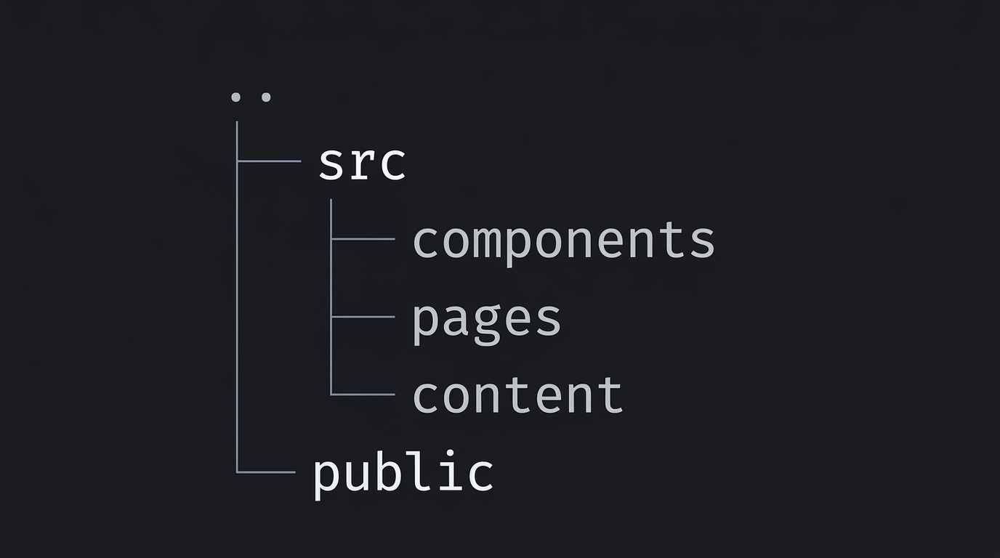

Astro is a great fit for content-driven pages where performance and SEO matter.

In this post, we cover:

- project structure,
- reusable section components,
- and content organization for long-term maintainability.

Here is a typical Astro project layout:

Use this as a baseline for your own landing page and iterate from there.
